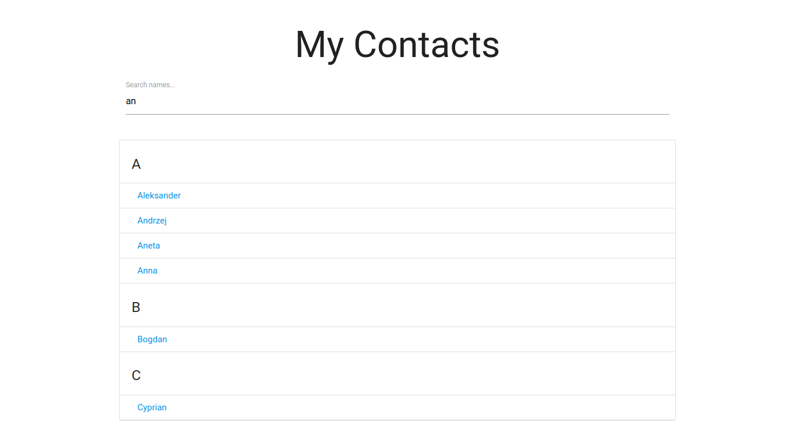

# Filterable list with Materialize.css front-end
 Simple filterable list built using nothing but vanilla JavaScript and [Materialize.css](https://materializecss.com/).

The project was created basing on [Brad Traversy](https://www.traversymedia.com/) tutorial.

